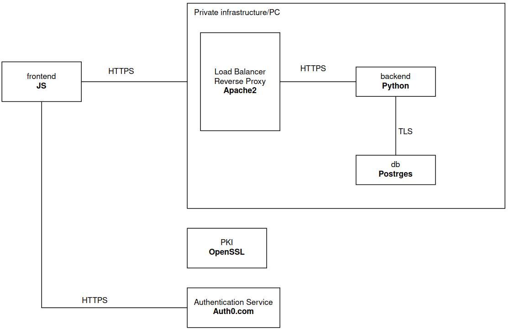

# Cybersecurity - PASCAL (ITS-Digital I YEAR 2022)
This is a [git repository](https://en.wikipedia.org/wiki/Git) which is hosted on GitHub; a beautiful place where we learn together cybersecurity and what faith will bring us. In this README I write my notes of the course but much of the content is, for brevity, a link to external resources. If you have any suggestion to improve this text or the course, please open an [issue](https://github.com/v-research/pascal/issues/new/choose).

**Table of Content**
* [Lesson 1 - Dust It Off and Move on](#lesson-1---dust-it-off-and-move-on)

## Lesson 1 - Dust it Off and Move on 
When you start from the beginning, you are supposed to move forward, but let's make a step back instead!
We'll [dust it off](https://www.youtube.com/watch?v=LSiooa1Kym0) and recap the
main concepts of the [previous course](./README.md) in a short while.
There's a common misconception to discuss first. 

People believe they can and
need to learn how to *do* things as quickly as possible, as painlessly as
possible, as fast and superficially as possible so that they can move forward
and [choose life, a job, a career](https://www.youtube.com/watch?v=SaP7qmsQbSI)
(IT version [here](https://www.youtube.com/watch?v=HJXIWhC6xOk)).
The truth is that only **hackers** live a life. Only "a person who delights in having an intimate understanding"
clearly sees the beauty or the virtue of what is around him.

Well, of course an **hacker** "delights in having an intimate understanding understanding of the internal workings of a system, computers and computer networks in particular [and] the term is often misused in a pejorative context, where cracker would be the correct term" [RFC-1392](https://tools.ietf.org/html/rfc1392), but we can generalize the definition for now.

You may wonder why. Why can't we let life pass by and be happy? Why can't we look at life as an afterthought as if it were something outside us, that does not concern us.
Nietzsche said it quite clearly
```
All living is an obeying.
[...] The one who cannot obey himself is commanded.
[...] commanding is harder than obeying.
And not only that the commander bears the burden of all obeyers,
and that this burden easily crushed him:
In all commanding it seems to me there is an eperiment and a risk;
and always when it commands, the living risks itself in doing so.
Indeed, when it commands itself, even then it must pay for its commanding.
It must become the judge and avenger and victim of its own law.

Thus spoke Zarathustra (1885) Friedrich Nietzsche
```

So, if you are not the ruler of your life, if you don't listen carefully, and look in depth into the details...
if you absently let life choose for you, you are commanded. 

Now that we hopefully start with the correct mindset, in the following, there is a list of very important aspects that you should have clear in mind
before moving forwards to the next lessons. You can find all the answers [here](README.md) but be curious!
- The definitions of hacker and cracker.
- The CIA-triad... we are all sick of it but it's important.
- The "least privilege principle."
- Hash functions.
- Password best practices.
- Brute-force attack and dictionary attack.
- Cybersecurity of data in-transit and at-rest.
- Networking and sniffing attack.

### Go on!
In this course we are going to: 

1. Build a *login systems* because we learn by doing and the concepts listed in the next item need to be clearly understood -- Ok, it should be the second point but properties are boring, coding is fun!
2. Explore some cybersecurity properties and concepts such as: authentication, identity[, and](./oxford-comma.jpeg) trust -- Yep, boring... necessary and boring.
3. Test some attacks (logical flaws) on the systems we are going to build. XSS [CAPEC](https://capec.mitre.org/data/definitions/63.html)/[CWE](https://cwe.mitre.org/data/definitions/79.html), SQL-injection [CAPEC](https://capec.mitre.org/data/definitions/66.html)/[CWE](https://cwe.mitre.org/data/definitions/89.html), and CSRF [CAPEC](https://capec.mitre.org/data/definitions/62.html)/[CWE](https://cwe.mitre.org/data/definitions/352.html) will be the first. 
4. Build a [PKI](https://en.wikipedia.org/wiki/Public_key_infrastructure) (Public Key Infrastructure) so that we are never going to be afraid of generating certificates!

Every project start from its design. Please, do never start coding withe are going to build the following architecture.



### Git & GitHub.com
[GitHub.com](https://github.com/) is a website that provides repositories as a service. On GitHub,
you can create a new repository (or repo for brevity) which is a container of
data. So, a repo is a portion of an hard disk, accessible via the Internet (via web
or terminal) were you can store some data. But GitHub repos are `git` repos, meaning that
the technology used to handle concurrency and version control is git. In the following, 
there are a few commands that should cover what you need to know to use git and github. 

See [here](https://en.wikipedia.org/wiki/Git) for an overview on Git and the [user manual](https://git-scm.com/docs/user-manual.html) for an in-depth understanding of Git.

- Register on GitHub and create a new repo (I called it `yals` - yet another login system).
- Download the git repo from GitHub: `git clone git@github.com:rocchettomarco/yals`
- Align local data with the remote: `git pull`
- Add a file to a commit (either a new or a modified file): `git add <file>`
- Create a commit (comment is mandatory): `git commit -m "this is a comment"`
- If you want to commit all the modified files, without adding each one of them: `git commmit -am "comment"`
- Upload the commit to the remote: `git push`
- Remove a file: `git rm <file>`
- Remove a directory: `git rm -r <directory>`
- Check the status of the files: `git status`
- Create a new local branch: `git checkout -b <branch>`
- Add the new branch to the online repo (remote): `git push origin <branch>`

### Lesson 2
- Authentication (we authenticate sw, not ppl), Identity (something you know, have, are), and trust (chain)
- Auth0 token exchanges (based on identity, public key crypto, tokens)
- Analysis of token exchange
- JWT.io

In the following the message sequence chart of the interaction between the frontend and the Auth0.com authentication service.


- Authenticated API
- Auth0 features
